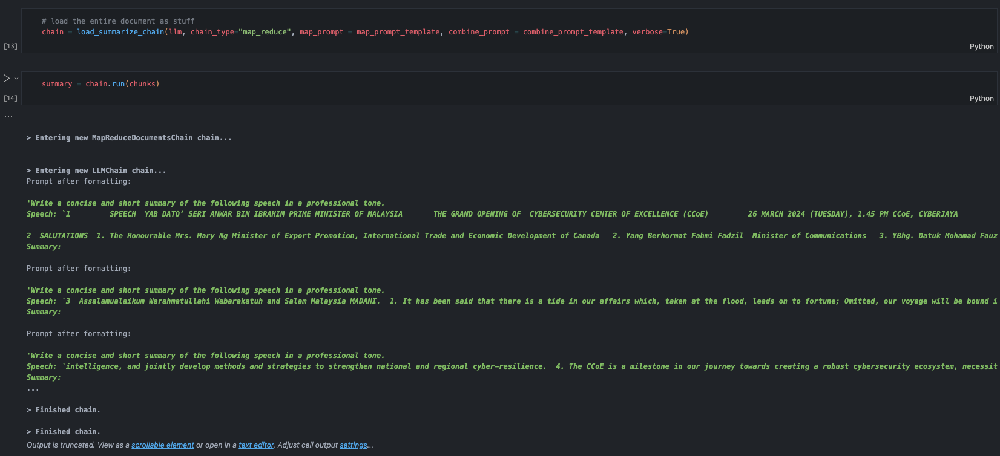

# Text Summarization Using LangChain



## Introduction

This project consist of the usage and application in various techniques for text summarization using LangChain.

### Techniques 1: Basic Text Summarization:

**Use Case**: Small text file

Method:

1. Using LangChain Schema to customize HumanMessage and SystemMessage
2. Load text directly to llm model
3. Produce summary

### Techniques 2: Prompt Template Text Summarization:

**Use Case**: Small text file

Method:

1. Using PromptTemplate to create custom prompt with various variables.
2. Load text, and variable to the llm model
3. Produce summary

### Techniques 3: Stuff Document Text Summarization:

**Use Case**: Small Pages of pdf file

Method:

1. Load pdf files (suitable for pdf with 1 or 2 pages to limit token size of llm model)
2. Convert pdf data to text.
3. Convert the text to document
4. Using PromptTemplate to create custom prompt with various variables.
5. Load text, and variable to the llm chain model with "stuff" as parameter for chain_type
6. Produce summary

### Techniques 4: Map Reduce Text Summarization:

**Use Case**: Large pages of pdf file

Method:

1. Convert large document into chunk
2. Send the chunk to llm model
3. For every chunk we will get the summary
4. llm model will combine the summary for each chunk and provide the final summary

### Techniques 5: Refine Chain Text Summarization:

**Use Case**: Large pages of pdf file

Method:

1.  Convert large document into chunk
2.  Send the chunk to llm model
3.  For every chunk we will get the summary
4.  First chunk summary + 2nd chunk will be send to the llm back to produce 2nd chunk summary
5.  The 2nd chunk summary will combine with 3rd chunk text and will be send to llm to produce 3rd chunk summary. AND so on.
6.  Output the summary based on custom prompt template

### Techniques 6: Map Reduce with Custom Prompt Text Summarization:

**Use Case**: Large pages of pdf file

Method:

1.  Convert large document into chunk
2.  Send the chunk to llm model
3.  For every chunk we will get the summary
4.  Create a custom prompt
5.  llm model will combine the summary for each chunk and provide the final summary based on prompt

## Technology Used

The following modules are used in this project:

- OpenAI API
- LangChain
- PyPDF2

## Getting started

To run this demo project, create an virtual environment and install the src package:

1. Clone the repository:

2. create .env files with the following secret keys:

```bash
OPENAI_API_KEY
```

3. Install Dependencies

```bash
pip install -r requirements.txt
```

4. Run the various jupyter notebook files
